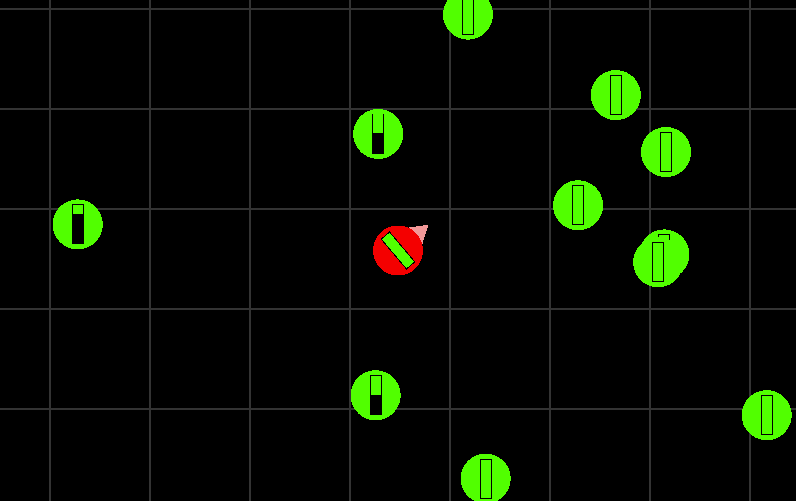

# Discord game

To run the game:
```sh
npm install
npm start
## visit http://localhost:8080
```
The game should look like this:


The renderer is PIXI v5, though the game doesn't do pixi any justice.

The controls are
- w - up
- a - left
- s - down
- d - right
- mousemove - look around
