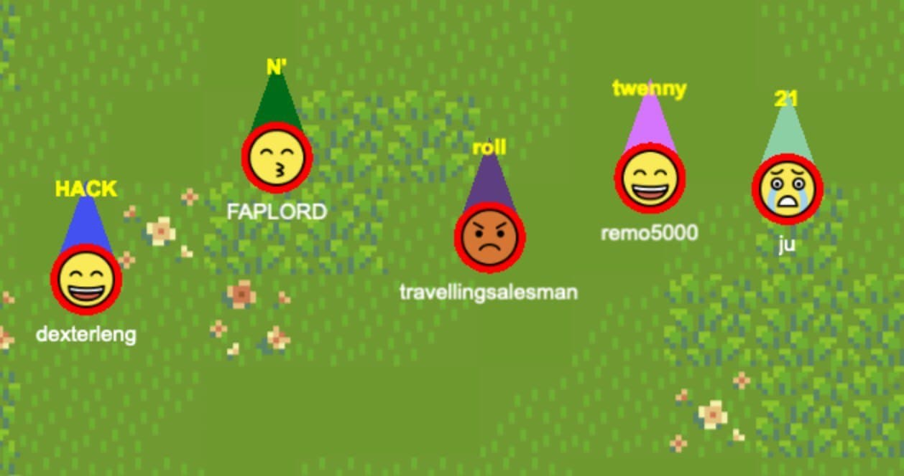

# Discord spatial layer

We built a multiplayer game that sits on top of any Discord server.
All users of a Discord server can hang out, move around, and chat
in real-time in a 2D virtual space.

## Introduction

In lieu of an actual childhood,
I fondly recall hanging out and chatting with my friends in Henesys Market 
and fishing/cutting trees together in RuneScape's Draynor Village.

There's something uniquely magical about that sort of experience,
and I'm pretty sure it's not just the nostalgia talking.
There's a raw and real human need for connection
and this has been solved somewhat by chat/social apps 
such as MSN Messenger, Telegram, and Discord.
But I've always felt that they never came close to the 
fun I had just sitting around in the FM with my friends:
useful as they are, something is missing from these apps.

What is that *je ne sais quoi*? I believe it's _spatiality_
and _interactiveness_. 
Hanging out in Maple or RS is especially compelling because 
it has something more than just chat: 
you can express yourself with your movement, fashion choices, your
skills, your facial emotions, and so on.
So we set out to build a spatial "layer" that sits on top
of the social apps we know and love.
We hope that people can use it to form and sustain 
stronger and more lasting friendships over the Internet.

## Features

- Connects seamlessly to your Discord account
- Move around and chat
- Chat appears above your head
- Use number keys 1-5 to change your mood (corresponds to MapleStory)
- Available both as a [standalone webpage](https://juxd.github.io/discord-spatial-layer/)
and as a Google Chrome extension (see submitted links)

## User flow

### For Github Pages

1. Type `!joinspace` into a server; our bot DMs a secret to the user
2. Navigate to [GitHub Pages link](https://juxd.github.io/discord-spatial-layer/)
3. IF ON FIREFOX type in about:config, and set network.websocket.allowInsecureFromHTTPS to true
4. Enters secret into the GitHub Pages link
5. You have now joined the spatial layer and can move around, chat and use emojis.

### For Google Chrome Extension

1. Install the Google Chrome Extension 
2. Navigate to the Discord web client
3. Click the extension; 
4. Type `!joinspace` into the server channel; our bot DMs a secret to the user
5. Enter the secret into our front end
6. You have now joined the spatial layer and can move around, chat and use emojis.

## Technical details

We used a couple of libraries:

- Discord API for the Discord bot
- Nengi for the multiplayer networking 
- PixiJS for the rendering engine

We built the server auth flow ourselves. The primary challenge is how to match the Discord user with the person who joins the game, so when you type `!joinspace` our bot will DM you a secret (e.g. "chubby-flappy-bird"). The server knows which secret it's given to which Discord user, so when you enter the secret and join the server we can then assign you the right avatar.

## Difficulties and things we've learned

Dexter: "I wasted a day on a Chrome Extension"
Vignesh: "Bro it's a hackathon there's nothing to think you just do"
Julius: We adapted well but we could have a better job at understanding what we wanted,

## Why would anyone use this? What is the point of it all?

There are lots of startups in this space like Gather Town,
but (in my opinion) they won't get much traction because they aim
to be a *tool*, not a *community*.
We want to build something that piggybacks on--supplants--the communities
already existing in groups like Discord and Telegram.
As to why not just play a game instead:
our spatial layer is really lightweight and doesn't require a download:
good luck getting the 1,000 people on your server to download 20GB of game.

## Extensions

We've built a base of movement and chat, the two most important features.
We want to give more activities for users to do and increase Discord integration.
For instance, we want to allow users to play games with Discord bots like catch Pokemon,
farm, fish, etc. 
We want to build persistent user and server storage.
We also want to allow each server to place objects in and customise the look of their server.